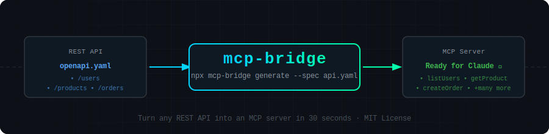

<div align="center">



# mcp-bridge

### Turn any REST API into an MCP server in 30 seconds.

[](https://www.npmjs.com/package/mcp-bridge)
[](https://www.npmjs.com/package/mcp-bridge)
[](LICENSE)
[](https://github.com/yourusername/mcp-bridge/stargazers)
[](https://discord.gg/your-invite)

**MCP (Model Context Protocol) is the standard for connecting AI agents to tools.**  
**Every REST API in the world just became an MCP server.**

[**Quick Start**](#quick-start) · [**Examples**](#examples) · [**Docs**](docs/) · [**Discord**](#community)

</div>

---

## The Problem

You want Claude, Cursor, or Windsurf to use your API. But creating an MCP server means:

- Writing hundreds of lines of boilerplate
- Manually mapping every endpoint to an MCP tool
- Handling auth, schemas, and error handling yourself
- Keeping it in sync as your API evolves

**There had to be a better way.**

---

## The Solution

```bash
npx mcp-bridge generate --spec https://petstore.swagger.io/v2/swagger.json
```

That's it. A fully working MCP server drops into `./mcp-server/`. Zero config. Zero boilerplate.

<details>
<summary>See what gets generated →</summary>

```
mcp-server/
├── index.ts          # Ready-to-run MCP server
├── tools/            # One file per API endpoint
│   ├── getPets.ts
│   ├── createPet.ts
│   └── deletePet.ts
├── schemas/          # Auto-generated Zod schemas
├── auth.ts           # Auth handling (API key, Bearer, OAuth)
└── package.json      # Ready to npm install && npm start
```

</details>

---

## Quick Start

### Option 1: Generate from a URL
```bash
npx mcp-bridge generate --spec https://api.example.com/openapi.json
```

### Option 2: Generate from a local file
```bash
npx mcp-bridge generate --spec ./openapi.yaml --out ./my-mcp-server
```

### Option 3: Auto-discover from a running server
```bash
npx mcp-bridge discover --url https://api.example.com
```

### Option 4: Watch mode (re-generates on spec changes)
```bash
npx mcp-bridge watch --spec ./openapi.yaml
```

---

## Connect to Claude Desktop

After generating, add this to your `claude_desktop_config.json`:

```json
{
  "mcpServers": {
    "my-api": {
      "command": "node",
      "args": ["/path/to/mcp-server/index.js"],
      "env": {
        "API_KEY": "your-api-key"
      }
    }
  }
}
```

Restart Claude Desktop. **Your entire API is now available as Claude tools.**

---

## Examples

### GitHub API → MCP
```bash
npx mcp-bridge generate \
  --spec https://raw.githubusercontent.com/github/rest-api-description/main/descriptions/api.github.com/api.github.com.json \
  --filter "repos,issues,pulls" \
  --auth bearer
```

> Now ask Claude: *"Open a PR from feature/auth to main with a summary of the changes"*

### Stripe API → MCP
```bash
npx mcp-bridge generate \
  --spec https://raw.githubusercontent.com/stripe/openapi/master/openapi/spec3.json \
  --filter "customers,payments,subscriptions" \
  --auth "api-key:Authorization"
```

> Now ask Claude: *"Show me all failed payments from the last 7 days and draft refund emails"*

### Your own API → MCP
```bash
npx mcp-bridge generate --spec ./openapi.yaml --name "my-company-api"
```

---

## Features

| Feature | Status |
|---|---|
| OpenAPI 3.x support | ✅ |
| Swagger 2.0 support | ✅ |
| Auto schema generation (Zod) | ✅ |
| Auth: API Key, Bearer, OAuth2 | ✅ |
| Endpoint filtering (`--filter`) | ✅ |
| Watch mode | ✅ |
| TypeScript output | ✅ |
| JavaScript output | ✅ |
| Pagination handling | ✅ |
| Error normalization | ✅ |
| Auto-discovery (no spec needed) | ✅ |
| GraphQL support | 🚧 Coming soon |
| gRPC support | 🚧 Coming soon |

---

## Filtering Endpoints

Don't want to expose your entire API? Filter it:

```bash
# Only include specific tags
npx mcp-bridge generate --spec ./openapi.yaml --filter "users,products"

# Exclude sensitive endpoints
npx mcp-bridge generate --spec ./openapi.yaml --exclude "admin,internal"

# Only GET endpoints (read-only mode)
npx mcp-bridge generate --spec ./openapi.yaml --methods "GET"
```

---

## Programmatic Usage

```typescript
import { generate } from 'mcp-bridge';

const server = await generate({
  spec: 'https://api.example.com/openapi.json',
  output: './mcp-server',
  auth: { type: 'bearer', env: 'MY_API_TOKEN' },
  filter: { tags: ['users', 'products'] },
});

console.log(`Generated ${server.toolCount} MCP tools`);
```

---

## Configuration File

Create `.mcp-bridge.yml` in your project root:

```yaml
spec: ./openapi.yaml
output: ./mcp-server
auth:
  type: bearer
  env: API_TOKEN
filter:
  tags:
    - users
    - products
  methods:
    - GET
    - POST
watch: false
typescript: true
```

Then just run:
```bash
npx mcp-bridge generate
```

---

## CI/CD Integration

Keep your MCP server in sync with your API automatically:

```yaml
# .github/workflows/sync-mcp.yml
name: Sync MCP Server
on:
  push:
    paths: ['openapi.yaml']

jobs:
  generate:
    runs-on: ubuntu-latest
    steps:
      - uses: actions/checkout@v4
      - run: npx mcp-bridge generate --spec ./openapi.yaml --out ./mcp-server
      - uses: peter-evans/create-pull-request@v6
        with:
          title: "chore: sync MCP server with API changes"
          branch: "auto/sync-mcp"
```

---

## How It Works

```
Your OpenAPI Spec
      │
      ▼
  ┌─────────────────────────────────────┐
  │          mcp-bridge parser          │
  │  • Resolves $refs                   │
  │  • Normalizes OpenAPI 2/3           │
  │  • Extracts endpoints + schemas     │
  └────────────────┬────────────────────┘
                   │
                   ▼
  ┌─────────────────────────────────────┐
  │         MCP Tool Generator          │
  │  • Maps endpoints → MCP tools       │
  │  • Converts JSON Schema → Zod       │
  │  • Generates descriptions from docs │
  │  • Handles auth injection           │
  └────────────────┬────────────────────┘
                   │
                   ▼
  ┌─────────────────────────────────────┐
  │       Ready-to-run MCP Server       │
  │  • @modelcontextprotocol/sdk        │
  │  • Full TypeScript types            │
  │  • Works with Claude, Cursor, etc.  │
  └─────────────────────────────────────┘
```

---

## Supported AI Clients

Works out of the box with any MCP-compatible client:

- **Claude Desktop** (Anthropic)
- **Cursor**
- **Windsurf** (Codeium)
- **Zed**
- **Continue.dev**
- **Any MCP-compatible agent**

---

## Contributing

We love contributions! See [CONTRIBUTING.md](CONTRIBUTING.md).

Priority areas:
- [ ] GraphQL → MCP support
- [ ] gRPC → MCP support  
- [ ] Web UI for visual endpoint selection
- [ ] More auth providers
- [ ] Test suite improvements

---

## Community

- 💬 [Discord](https://discord.gg/your-invite) — get help, share what you built
- 🐦 [Twitter/X](https://x.com/yourusername) — follow for updates
- ⭐ Star this repo to support the project!

---

## License

MIT © [Your Name](https://github.com/yourusername)

---

<div align="center">

**If mcp-bridge saved you time, please ⭐ star this repo.**  
It helps other developers find it.

</div>
